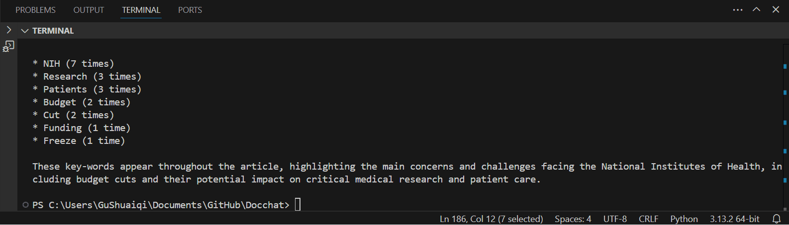

[](https://github.com/guisabellla/Docchat/actions/workflows/tests.yml)

# Docchat

This program allows me to interact with LLM llama3-8b-8192 on Groq and ask it to analyze documents. 
The program is good at summarizing texts for documents and main argument of a text.


The format of the command is:
```
python docchat.py [-h] --questions questions.txt
```
The questions are stored in the `questions.txt`.

### Try:
When I enter the command in python terminal:
```
python docchat.py news2.txt --questions questions.txt
```

I get the result:
```
Document loaded. Summary:
 Here is a cohesive paragraph summary:

The National Institutes of Health (NIH), the world's largest funder of biomedical research, is facing significant challenges that may have far-reaching consequences for the health of Americans. The agency has fired over 1,300 employees and cancelled over $2 billion in research grants, according to Dr. Francis Collins, who led the agency for 12 years. The NIH is also grappling with a proposed 40% budget cut, 
staff firings, and supply shortages, which have led to low morale and concerns about the agency's ability to conduct research and care for patients. These changes have sparked worries among scientists and patients, with some considering leaving the US to continue their research and others concerned about the impact on life-saving trials and research. As a result, patients, including those seeking treatment for rare diseases, are expressing concern and disappointment, leaving them without hope for potential treatments.

Q: Summarize the document.
A: The National Institutes of Health (NIH), the world's largest funder of biomedical research, is facing significant challenges, including staff firings, research grant cancellations, and a proposed 40% budget cut. This has led to low morale, supply shortages, and concerns 
about the agency's ability to conduct research and care for patients, sparking worries among scientists and patients, particularly those 
with rare diseases seeking treatment.

Q: What is the author's main argument?
A: The author's main argument is that the National Institutes of Health (NIH) is facing significant challenges, including budget cuts, staff firings, and supply shortages, which have compromised its ability to fund research and care for patients, ultimately putting the health of Americans at risk.
Q: What are some key-words that frequently appear in the article? How many times do the key-words appear?
A: The key-words that frequently appear in the article are:

* "NIH" (5 times)
* "research" (3 times)
* "budget" (2 times)
* "employees" (1 time)
* "grants" (1 time)

Note: The frequency count only includes the excerpts provided and does not account for the full article.
```
This is particularly a good result on summarization and restating the author's main argument. However, the program has poorer performance on providing frequently appeared key-words, as sometimes it gives words that only appears one time in the document as frequently appeared key-words.

### Note
I thought the "1-2 sentence explanation of what you believe your grade should be" should be added to the readme file. When I realize I should upload this part to sakai, I already turned the work in... Here is my 1-2 sentence explanation:

I am not sure how to exactly deduct points but my test-cases badge does not pass the tests. I earn 2 extra credits for enabling asking questions in English when the document is non-english, I successfully tested this part with `news_spanish.txt` file. 
